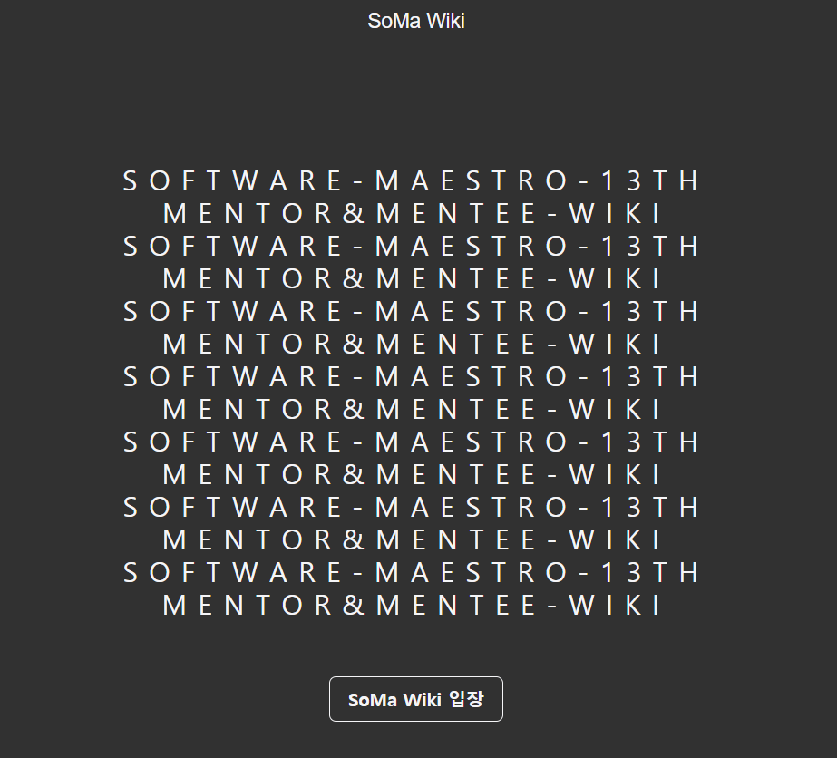
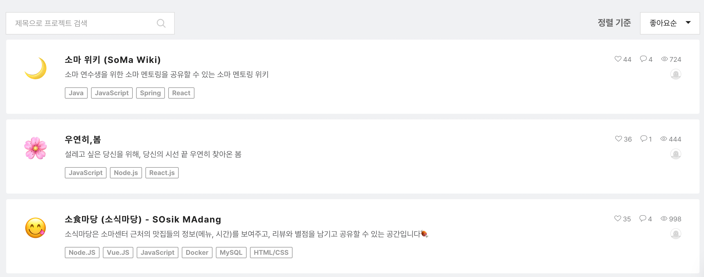

# Soma-Wiki
* * *

### 프로젝트 소개
__소마 멘토링에서 배우고 느낀 것__  
소마 위키에서 공유하세요

__놓쳤던 멘토링__  
소마 위키에서 확인하세요

__같은 멘토링을 들었던 다른 연수생들의 생각__  
소마 위키에서 찾아보세요

__우리가 만들어가는 소마 위키__  
지금 바로 멘토링 정리 글을 공유해 주세요!

__소마 13기 연수생이면 누구든지 사용할 수 있습니다__

구경만 하고 싶다면
ID 입력창에 “guest” 만 입력하고, 엔터키를 눌러주세요!

__직접적인 멘토의 약력, 멘토링/특강 자료가 아닌  
개인적으로 정리한 내용, 한 줄 요약 등을 올려주세요!__
* * *
### 프로젝트 기능
- 로그인 / 비밀번호 변경
- 글 작성, 조회, 삭제
- 댓글 작성, 조회, 삭제
- 멘토 검색
- 실시간 인기 랭킹
- 반응형 웹사이트
* * *
### 기술스택
- FE: React
- BE: Spring
* * *
### 팀원
- BE: 권기호, 우태균, 조영상
- FE: 이정원, 이호현
* * *

### SW 마에스트로 미니프로젝트 Peer Vote 1등
